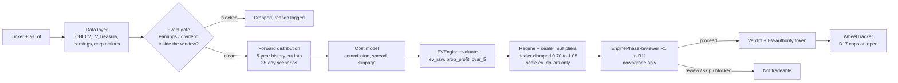
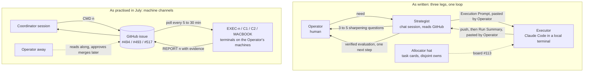

# Where the Wheel Engine Stands, and How Its Agents Work

> Restart brief, 2026-09-11. Basis: `origin/main` at `ec1c5c5` (2026-07-28), the live GitHub state, a runtime check in this sandbox, and a two-workflow analysis (8 specialist readers, 8 adversarial verifiers, 2 completeness critics). Evidence labels follow OPERATING_MODEL.md §5: **read** means checked directly in the repository or on GitHub; **run** means actual command output from this sandbox on 2026-09-11; **open** means it cannot be settled by reading or running anything here.

## How to read this

Part 1 is the product: what the engine is, how a candidate becomes a verdict, what the evidence says, and where work stopped. Part 2 is the working schema: the rules your AI agents follow, how they were actually followed, and what to change. Section 0 is the health check and the short list of things to do first. Every number in this document was either read from a named file or produced by a command whose output is quoted.

## 0. Health check on 2026-09-11

| Check | Result | Label |
|---|---|---|
| Provider bring-up (OPERATING_MODEL.md §9.4 step 1) | `MarketDataConnector` (Bloomberg CSV path) selected and logged | run |
| 5-ticker EV smoke (§9.4 step 2) | 4 rows ranked in 11.8 s (MSFT, XOM, AAPL, UNH). JPM correctly dropped by the event gate: earnings 2026-10-13 inside the 35-day window. The doc's "five rows means healthy" is date-dependent; four rows plus one event drop is healthy today | run |
| Launch-blocker subset (`/launch-blockers`) | 118 passed, 2 warnings, 43.7 s | run |
| Full-suite collection | 3,720 tests collected | run |
| Data frontier | OHLCV ends 2026-07-02, 71 days behind the wall clock; the engine warns on every run and offers `SWE_REFUSE_STALE_LIVE=1` to hard-refuse | run |
| Earnings-calendar overlay | snapshot as-of 2026-07-03, 70 days old; the lockout is decaying toward the historical file's ~8% coverage | run |
| `check_manifest_coverage.py` | 1,338 tracked files, 0 uncovered, 0 orphans | run |
| `gen_worklog_index.py --check` | INDEX.md current | run |
| `check_doc_currency.py` | **FAIL** (exit 1): PROJECT_STATE.md 71 days old, CHANGELOG.md 62 days behind; the fail threshold is 45 days. CI runs this step without `continue-on-error`, so any PR opened today fails the "FILE_MANIFEST Coverage" job until both docs are refreshed | run |
| `check_lane_claim.py` | OK, no decision-layer files touched on this branch | run |

## The repository at a glance

| Fact | Value | Label |
|---|---|---|
| First commit | 2025-11-22 | read |
| Commits on `main` | 961; by month: 21 (2025-11), 2, 8, 72, 132, **481 (2026-05)**, 185, 60 (2026-07) | read |
| Pull requests merged | 113 in May, 100 in June, 60 in July; the last merge was #522 on 2026-07-28 | read |
| Last human-visible action | PR #523 opened 2026-07-29 (docs restructure, CI 9/9 green, mergeable), never merged | read |
| Open pull requests | #523 (docs) and #507 (draft: move Bloomberg data from GitHub to Google Drive; CI red by design until a secret exists) | read |
| Open issues | 13, including three coordination channels (#113 board, #493 mailbox, #494 Control Tower, #517 campaign channel) and six data-defect issues | read |
| Remote branches besides `main` | 6: `Dashboard`, `backup/drive-tier-c-2026-07-22`, `claude/daybot-bloomberg-pull`, `claude/docs-structure`, `data/drive-migration`, `deep-history/bloomberg-raw` | read |
| Code | `engine/` 47 modules, 37,824 lines; `engine_api.py` 159 KB; `scripts/` 101 files; `tests/` 180 files | read |
| Documentation | 312 markdown files outside `archive/`, 4.1 MB; the mandatory fresh-agent read (OPERATING_MODEL.md + PROJECT_STATE.md) is 109 KB | read |
| Author of record | every commit is authored by the Operator's identity; agents commit as the Operator | read |

## Corrections to the mental model

These are the corrections I gave in conversation, now checked against the repository.

- **Agents have no memory between sessions.** OPERATING_MODEL.md §2 says it in one line: "Durable state lives in the repository, not in a session." The repository's memory is PROJECT_STATE.md, DECISIONS.md, CHANGELOG.md, and 165 worklog fragments. That memory decayed during the break exactly as a human's would: the state file is 71 days old and the repo's own guard now fails on it.
- **Agents coordinate through structure, not conversation.** The written mechanism is an allocator handing out task cards with disjoint file ownership, worktrees per terminal, a CI gate on the three decision-layer files, and a GitHub issue as the board. Part 2 shows how much of that was used.
- **Sharpening a request means making it precise, not more ambitious.** §4.1 already encodes this: three to five questions, only when warranted, about intent and priority, never about implementation the agent should determine itself.
- **Verification beats prompt wording.** The project already lives by this: a 12-section Run Summary with pasted output, three evidence tiers, and the rule that a passing test suite is not proof of correctness.
- **The schema was written for a different machine.** Local terminals in VS Code, worktrees on the Operator's disk, a human pasting prompts and summaries between two chat windows. This session is a remote sandbox that can strategize, execute, and verify by itself. Part 2 treats that gap as the main design question.

# Part 1. The product: what it is, how it decides, what the evidence says

Five readers covered the decision path and models, the data layer, the operator surfaces, the validation evidence, and the in-flight queue. An adversarial verifier re-checked each reader's headline claims against the code, the committed artifacts, and GitHub. Labels: **read** means recomputed from the repository or GitHub by a verifier; **run** means command output from this sandbox today; **reported** means a reader's finding the verifier did not re-check; **open** means it cannot be settled here. A note on dates: git commit dates in this repo are local time (UTC minus four hours) and GitHub's timestamps are UTC, so the same merge can read 2026-07-28 in one place and 2026-07-29 in the other.

## 1.1 What this engine is, in one page

The wheel is a two-step options income loop on stocks you would be willing to own. Step one: sell a cash-secured put. A put obliges you to buy 100 shares at a fixed price (the strike) by a fixed date (expiry). You are paid cash now (the premium) and you park the full purchase price in cash, so you can never be forced to sell something else to pay for it. If the stock stays above the strike, you keep the premium. If it falls below, you are assigned the shares. Step two: sell a covered call on those shares, the mirror promise to sell them at a higher strike, again for premium, until they are called away. Then start over.

The engine ranks these trades across the S&P 500. For each name it estimates the expected value (EV) of selling one put: the probability-weighted average dollar outcome, net of costs, built from that stock's own price history and its implied volatility (IV, the size of move the options market is pricing in). It also emits `prob_profit`, its estimate of the chance the trade ends profitable. It answers one question: which put (or covered call, or strangle) to sell, and in what order.

What it does not do. It never places, modifies, or cancels an order; there is no order-routing surface anywhere in the repository and every brokerage path is read-only by invariant (read). It does not manage a position once open; the exit evaluator (DECISIONS D25) is proposed, not adopted. It does not forecast dollars: the docs record `ev_dollars` as a risk-aware ranking score, not a dollar-profit forecast. It does not see a crisis before the market has repriced. It does not beat the index.

The framing the docs settled on is a **defensive premium sleeve**. Used as a supervised decision aid and sized as a complement to long equity, it produced conservative income in backtests (S38: +33% over five years, about +5.9% a year) and refused most trades once a crisis had repriced. It lagged the market in every strong bull window and beat the S&P in only 2 of 11 windows in the $500k campaign. Bear markets are not automatically good for it: the window from 2021-07 to 2022-12 lost 13.5% against the S&P's minus 11.1% (read).

The hard invariant in one sentence: no tradeable candidate exists except through `EVEngine.evaluate`, ranking happens only in `rank_candidates_by_ev`, and every reviewer may lower a verdict but may never rescue a negative-EV trade (read; pinned by the launch-blocker tests, which passed here today).

## 1.2 How one candidate becomes a verdict

Three files are the decision layer, the "trio": `engine/wheel_runner.py` gathers inputs and ranks; `engine/ev_engine.py` holds `EVEngine.evaluate`; `engine/candidate_dossier.py` holds the reviewer rules R1 to R11. Any pull request touching them must carry a lane-claim block, and CI enforces that (read).

Follow one name, AAPL, on the default path (read unless marked):

1. **Data, frozen at a date.** The provider is the committed Bloomberg CSVs unless `SWE_DATA_PROVIDER=theta`. Prices load up to `as_of`. Point-in-time (PIT) means nothing dated after `as_of` may touch the calculation. A name is dropped with fewer than 504 trading days of history, or when its last bar is more than 30 days behind the data frontier.
2. **Volatility and strike.** At-the-money IV is read as of the date, with dividend yield and the risk-free rate. Black-Scholes is solved backward for the strike at delta 0.25 over a 35-day horizon, rounded to 50 cents, and a synthetic premium is priced with the same formula. A real end-of-day market mid replaces it when the option-premium "rail" has a matching quote; without the gitignored premium files, every premium is synthetic and `edge_vs_fair` is zero by construction. Known hole (held finding F4): when PIT IV is missing at a historical date, the ranker falls through to the dateless 2026 snapshot IV, a look-ahead.
3. **Events.** If the holding window touches an earnings date or corporate action, `EVEngine.evaluate` returns a zeroed result and the name is dropped with the reason logged. Today's smoke run shows exactly this: JPM was dropped for `event_lockout:earnings@2026-10-13` (run). Macro events (FOMC, CPI) are wired but default off, because a whole-window lockout would empty the book.
4. **Scenarios.** The last five years of closes are cut into non-overlapping 35-day chunks, roughly 35 historical outcomes. Caveat D21: 35 calendar days are indexed as 35 trading bars, about 46% too long. When 30-day realized volatility is at least 1.30 times the one-year baseline, the spread is widened by up to 15% (the May "F4" fix).
5. **Regime dial.** A four-state Gaussian hidden Markov model (HMM) fitted to the last 504 daily returns yields a multiplier: crisis 0.2, bear 0.5, normal 1.0, bull_quiet 1.25. Held finding F3: the labels are assigned by rank, not by the sign of the state's mean return, so a steady low-volatility decline can be labelled bull_quiet and up-sized. A credit-stress multiplier (0.80 crisis, 0.92 stressed) comes from a live FRED fetch; there is no committed FRED file, and offline it silently becomes 1.0, which is what happened in this sandbox (run). Skew, news, and dealer multipliers are 1.0 on the Bloomberg path.
6. **EVEngine.evaluate, in order.** Event lockout; costs (65 cents commission per contract, spread, slippage); Black-Scholes fair value; terminal prices; per-path profit and loss with a $5 assignment fee; then `ev_raw` (the mean), `prob_profit`, a Wilson 95% interval (about 20 points wide at 35 scenarios), `cvar_5` (the mean of the worst 5%), a tail fit only when at least 200 paths exist (so not on the default tier), expected days held, the regime multiplier clamped to [0.0, 1.25], the dealer multiplier re-clamped to [0.70, 1.05] when a chain exists, and `ev_dollars = ev_raw × multiplier`. Exit-leg costs are computed but not subtracted (D19, deferred).
7. **Rank.** Survivors need `ev_dollars` at or above the floor (default 0) and are sorted by EV per day.
8. **Review.** R1 to R11 run only when a dossier is built (`build_candidate_dossiers` or the `/api/tv/dossier` endpoint), never inside the ranker. R1a non-finite EV: blocked. R1 EV below zero: blocked. R2 no chart: review, and the ladder stops there. R3 chart price versus spot more than 2% apart: skip. R4 phase contradiction: skip (dormant, nothing supplies a phase). R5 EV of at least $10: proceed, else review. R6 dealer short-gamma or put wall: review (needs an option chain, so dormant on Bloomberg). R7 VaR, R8 stress, R9 sector at 25% of NAV, R10 single name at 10% of NAV: need a `PortfolioContext` and act only on proceed. R11 VIX above 25 with `prob_profit` above 0.90: review; VIX is threaded live. Reality today: the default chart provider reads a screenshots directory that does not exist, so a headless run stops every positive-EV candidate at R2 with "review" and R3 to R11 never execute. From the dashboard cockpit, which supplies NAV, holdings, and held puts, R7 to R10 can fire (read; a stale docstring in the trio says otherwise).
9. **Token and tracker.** A D16 EV-authority token is issued from the ranker row and refuses EV of zero or below, and consuming it re-checks the same thing. `open_short_put` consumes the token in strict mode and runs the D17 hard blocks. `make_live_book_tracker` arms R9 and R10; the delta and Kelly caps stay off (D22). Held finding F1: `roll_put` and `roll_call` change a position with no token consume and no D17 block, so a book can be rolled past the single-name cap that a direct open would refuse.

Reported, not verified: the dashboard's `/api/candidates` does not run the reviewer; it uses its own simpler ladder (proceed if EV of at least 10 and `prob_profit` of at least 0.65).

## 1.3 The models under the hood

| Model | Status on the default (Bloomberg) put path | Note |
|---|---|---|
| Black-Scholes pricing, delta-0.25 strike, synthetic premium, fair value | live | `edge_vs_fair` is zero by construction with synthetic premiums |
| Empirical forward distribution, five-year non-overlapping | live | about 35 scenarios; D21 horizon caveat; the cascade continues to overlapping, block bootstrap, HAR-RV, and a lognormal fallback |
| Realized-vol widening (ratio 1.30, max 1.15) | live | validation calls it "barely load-bearing" (reported) |
| Four-state Gaussian HMM regime multiplier 0.2 to 1.25 | live, put ranker only | covered-call and strangle rankers pass 1.0; held finding F3 |
| FRED credit-regime multiplier 0.80 / 0.92 | wired, network-dependent | silently 1.0 offline; no log when it fails |
| Dealer positioning multiplier [0.70, 1.05] | structurally dormant | needs an option chain, Theta only |
| Skew multiplier, open-interest input | dormant | skew "unavailable"; OI falls back to 1000 |
| News sentiment multiplier | stub, always 1.0 | D18, merged 2026-05-30 |
| POT-GPD tail fit and heavy-tail penalty | dormant on the default tier | needs 200 paths; can fire on the other tiers |
| Transaction costs | live | exit leg computed, not subtracted (D19) |
| Earnings and corporate-action event gate | live, decaying | see 1.4 |
| Macro event gate | wired, default off | whole-window lockout would empty the book |
| R9 sector cap, R10 single-name cap | armed only via `make_live_book_tracker` | library default off (D22) |
| Delta cap, Kelly cap | off in production | pending recalibration (D22) |
| Advisor committee (Buffett, Munger, Simons, Taleb) | diagnostic only | served at `/api/committee`; not in any verdict path |
| Exit evaluator (D25) | not adopted | awaits your decision |
| `regime_detector`, `signal_context`, `signals`, `portfolio_intelligence` | dormant | reported; `docs/MODEL_CARDS.md` §6 still documents the deprecated regime classifier rather than the live HMM |
| SVI volatility surface, portfolio copula | live, off the EV path | diagnostics and the display-layer simulator |

## 1.4 The data it runs on, and its state today

**Providers.** Two: the committed Bloomberg CSVs (default, runs anywhere) and Theta (`SWE_DATA_PROVIDER=theta`, needs a running Theta Terminal on the laptop). The connector reads ten CSVs under `data/bloomberg/` (prices, IV, dividends, earnings, treasury, VIX term structure, fundamentals, credit risk, liquidity, corporate actions) plus three "broad pull" panels: the earnings-calendar overlay, PIT dividend yield, and a macro calendar used only by the default-off macro gate (read). Only `WheelRunner` warns on an unrecognised provider value; `engine_api` falls back silently (read). Option-premium files live in a gitignored directory and are absent here.

**Frontier versus today.** Every daily engine file ends 2026-07-02, 71 days behind 2026-09-11 (run). `sp500_ohlcv.csv` holds 1,030,816 rows for 516 tickers from 2018-01-02; `data/bloomberg/` is 536 MB across 50 tracked files (read). The preflight pin `EXPECTED_FRONTIER = 2026-07-02` matches, so the test tree passes; only wall-clock warnings fire. Three warn-only alarms exist: the session hook (over 30 days), the connector frontier warning (over 7 days, live scans only), and an earnings-overlay alarm (over 45 days). `SWE_REFUSE_STALE_LIVE=1` turns warn-and-rank into hard refusal.

**The earnings lockout has decayed.** The overlay has two vintages (2026-06-18 and 2026-07-03, 1,027 rows) and only 22 rows carry a next earnings date on or after today (read). It fails open as it ages, so a live scan drifts toward the thin historical file's coverage of about 36 of 503 tickers. JPM's drop today shows the overlay still has some reach; most names will not be protected.

**Who refreshes, where, how.** Only you, at a logged-in Bloomberg Terminal (the university lab box). The current procedure is `docs/DATA_SUFFICIENCY_REVIEW_2026-07-21.md` §4 (PR #523 would move that file to `archive/2026-07/`). From a branch off live main: `SWE_PULL_MODE=forward SWE_PULL_END=<today>` with `scripts/pull_ohlcv.py`, then the same for `pull_vol_iv.py`, `pull_liquidity.py`, and the VIX, dividends, corporate-actions, and snapshot pullers. The shared panel helper is merge-only and auto-advances a stale pinned end date. Footgun: `scripts/pull_treasury_yields.py` overwrites the whole file with a default end of 2026-06-05, and the last refresh recorded a merge bug that truncated the 1994-onward history to 45 rows (caught and restored on the box, not fixed in the committed script). Afterwards, off the box: bump `EXPECTED_FRONTIER` and `EXPECTED_EARNINGS_CALENDAR_ASOF` in one commit, bump the data-test frontier constants, and regenerate the four regression snapshots (S27, S32, S34, S35), about four hours, or about two on three parallel workers. The last refresh was PR #472 on 2026-07-04, frontier 2026-06-04 to 2026-07-02, with the BKNG and CVNA split repair folded in (read). Nothing has touched `data/bloomberg/` since 2026-07-08.

**Open data queue.** Seven of the 13 open issues are data: #339 (BK and BNY are still two tickers; CASY has 71 bars), #355 (eleven names truncated under the 504-bar gate, including WMT at 141 bars), #354 (only dividend yield is PIT; sector and the IV snapshot are dateless), #357 (treasury 1-month rate is NaN before 2001), #412 (the pull list, partly executed), #454 (FDX and APTV spin-off seams still in the bytes: FDX close 374.88 to 293.92 at the seam), and #439 (BKNG and CVNA repaired on main, issue never closed). Four NaN-close price rows are tracked by no issue. Important correction from the verifier: the CASY and ten blue-chip backfills and the monthly PIT-fundamentals panel already landed on main as inert carriers under `staging/` (#478, 2026-07-04). What gates them is running `staging/integrate_phase1b.py` plus the re-baseline, not Terminal access (read). Still Terminal-only: a dated ratings panel, about eight further truncated names, the #412 tier-0 items, and the earnings backfill.

**Survivorship.** The served universe is survivor-only: 516 current members from 2018. Delisted history back to 1990 lives on branch `deep-history/bloomberg-raw` (35 commits ahead of main), restored into a gitignored directory and used only when `SWE_DEEP_HISTORY` is on. Turning it on is declared a re-baseline event. It is inert for live ranking (the forward window is five years) but required for any backtest starting before 2023 (read).

**PR #507, GitHub versus Drive.** An open draft (2026-07-21, base 14 commits behind main) that untracks 49 files (48 data files plus a spreadsheet), adds a manifest and two fetch scripts, and adds a Drive fetch step to one CI job. Before untracking, 48 of 48 files were verified byte-identical on Drive. Two test jobs fail by design until a `GDRIVE_SA_JSON` secret exists; the quantitative-validation job passed on the same commit without the data, which the PR does not explain (read). The git-history purge is a separate later job. Motivation: one file sits at 91% of GitHub's 100 MB blob cap. Policy conflict: ROADMAP C1 says keep tracking the CSVs as data commits (decided 2026-05-30) while OPERATING_MODEL.md §9.6 still calls that decision open. The PR says the Theta corpus was not backed up; the unmerged branch `backup/drive-tier-c-2026-07-22` records 8 of 9 Theta children verified with one pending (read). Nothing from either branch is on main.

## 1.5 What you use day to day

**Dashboard.** Two local processes: `python engine_api.py` on port 8787 and the Next.js app on port 3000 (the older 8811/3030 rig was retired 2026-06-10). Eight pages: cockpit, portfolio, top, feed, watchlist, calendar, research, terminal (read). The cockpit shows a regime banner, a drop funnel, the survivors table, and a dossier drawer backed by `/api/tv/dossier` with the live book attached. The portfolio page shows KPI cards, holdings, a risk radar against the R9 and R10 caps, margin, a Trades tab (#504), and a deposit-adjusted time-weighted return curve (#505, #506). `dashboard/README.md` is stale: it lists a trade-execution directory that does not exist (read).

**IBKR read-only book.** Three channels feed a gitignored directory: the claude.ai IBKR connector (agent-time only; primary for the snapshot; its trade feed lacks strikes and misses expiries), IB Gateway on port 4001 via `ib_insync` with `readonly=True`, and the Flex Web Service, the only accurate ledger because it records expiries and assignments (read). The adapter builds the portfolio views and imports nothing from the trio. Tests assert that no order method is referenced anywhere.

**Morning routine.** Open a Claude Code session, say "You are responsible for the Dashboard", type "update". The agent pulls summary, balances, and positions through the connector, saves them, and runs `scripts/dashboard_refresh.py all`, which regenerates the snapshot, rebuilds the wheel ledger from Flex, appends today's NAV point, and verifies in-process. Corrections from the verifier: "update" does not refresh the Trades tab, which needs the separate `scripts/ibkr_trades_ingest.py` flow; the runbook's step 5 tells the agent to stop if realized year-to-date diverges from "about $24k", a June anchor that a September run will almost certainly trip; and the documented Flex token window (to 2026-07-07) is stale on the repo's own evidence, since #504 shows a pull around 2026-07-17. The token's state today is unknown until the ledger refresh runs; regenerate it in Client Portal under Flex Web Service if it fails (read).

**Paper book.** `scripts/run_paper_book.py forward` re-ranks through the real engine on a caps-armed tracker, opens up to three EV-positive positions, and appends one out-of-sample point per day. `as_of` is clamped to the data frontier, so on a 2026-07-02 frontier every further run is a no-op (read). Outputs are API-only; no dashboard page exists. Whether the live forward book was ever seeded cannot be known from the repository.

**Other surfaces.** Four news stacks exist and none touches EV since D18; the `/api/news/ingest` ring buffer has no in-repo producer (read). The advisor committee is diagnostic only. TradingView appears as a webhook bridge and a chart-reading workspace, both non-deciding (reported).

**Needs your own machine:** IB Gateway with its daily two-factor login, the authorised IBKR connector, a valid Flex token, Theta Terminal (gates five pull steps), TradingView Desktop with its MCP server, Ollama for memos and the terminal chat, Playwright with logged-in Claude, ChatGPT, and Gemini sessions for `morning_run.py`, Node 20, headless Chrome, and the Bloomberg lab box for CSV refreshes. The runbooks describe a Windows box as the daily rig; issue #517 puts the Theta larder and the working Python environment on a MacBook. The repository does not say which machine hosts the daily rig (read).

## 1.6 What the evidence says

| Verdict | Finding | Key numbers |
|---|---|---|
| **proven** | Top-of-list selection skill is real and survives a leakage-certified holdout and a parameter freeze | holdout top-15 Spearman +0.371 [0.25, 0.49]; top-5 +0.597; frozen-at-2023-06-30 +0.366 versus production +0.294; executed-slice rank correlation positive in all 11 $500k windows, +0.25 to +0.71 (read from committed artifacts) |
| **proven** | Full-menu ordering is worthless | pooled rank correlation +0.02, interval [−0.02, +0.06]; quiet-bull regimes −0.11 (read) |
| **proven** | The data path is PIT-clean and deterministic, and the invariant holds | truncating post-date rows gave zero diffs; the freeze fixture reproduces to 1e-7; zero executed rows with EV at or below zero across ten configurations (read) |
| **proven** | A mechanical $500k book is usually profitable with shallower drawdowns than the index | 9 of 11 windows positive at full friction, mean +15.4% per 18 months, mean max drawdown 16.4% (read) |
| **proven, narrow** | Refusal after a crisis has repriced | S38: 97.8% refusal from 2020-02-15 to 05-15, about $215k of losses avoided (read) |
| **proven defect** | Top-bin `prob_profit` over-confidence, everywhere | PROJECT_STATE: the top bin is over-optimistic by 10 to 18 points across all ten configurations, and 9 of 10 exceed 10 points; the May calibration study: (0.95, 1] forecast 0.966 versus realized 0.695 on 105 trades; the $500k campaign: [0.9, 1.0] 0.922 versus 0.854 on 14,558 rows; your own 28 real top-bin puts: 0.936 predicted versus 0.821 realized (read). The gap's size depends on the convention used |
| **proven defect** | Survivorship inflates the edge | adding three failed banks to a 100-name 2022 to 2024 run cut the profit from +$263,695 to +$105,696, so 59.9% of that driver's own profit was illusory; per-candidate-day edge fell 23%; the EV model's mean did not move (read) |
| **proven defect** | The gate stack admits ruin-class books | eight ruin dates, all COVID-onset entries; the worst books lose 36.5% of NAV from entries at VIX 13.7 while holding 12 to 14 names across six sectors, at 3 to 7 times the modelled CVaR (read) |
| **proven defect** | The roll path bypasses the caps and the token (F1) | open in code; expected-failure test on main (read) |
| **refuted** | Beats the market | S38 +33% versus SPY about +85%; the rolling S43 never beats equal weight (−51 to −104 points); $500k campaign 2 of 11 windows, engine mean +15.4% versus S&P +23.0%; S34's dollars were 92% equity beta on assigned stock; S27 and S38 realized executed profit were negative (read) |
| **refuted** | Crisis detection | 89% of names flagged positive-EV at the March 2020 entry, realizing −$1,305 per contract at 82% assignment; the 2007 to 2009 lockbox: refusal failed every month and the entry rate rose 3.15 times into Lehman week; survival came from assignment-and-hold (read) |
| **refuted** | `ev_dollars` as a dollar forecast | full-menu correlation about zero; the docs say "ranking score, NOT a dollar-profit forecast" (read) |
| **refuted** (reported) | The May vol-widening fix closing the gap; the onset-aware R11 trigger | +0.56 points of a 59-point gap; R11 kept as is |
| **open** | A fix for the top-bin over-confidence | post-hoc recalibration failed leave-one-crisis-out; the tail-fit route is untested (reported) |
| **open** | D19 and D21 | deferred since 2026-05-30; the scope document is still a June draft (read) |
| **open** | True out-of-sample | the holdout is leakage-certified and the parameter freeze exists, but static constants saw all history; refitting the regime overlay collapses out of sample; no forward paper or real record exists in the repository (read) |
| **open** | Reproducibility of the $500k report | the rank-correlation figures and the window table reproduce from committed artifacts; the Brier score, the calibration bin table, and the transition finding do not, because the deriving scripts were not committed (read) |

Verifier notes worth keeping: the current committed regression snapshots carry rank correlations S27 0.178, S32 0.176, S34 0.313, S35 0.501, and older doc tables that quote other values are stale. The $200k companion campaign also ran with R10 armed, so the $500k campaign is not the only armed run; that companion found a look-ahead inside `_compute_live_nav` for any historical simulation. NFLX is not corrupted (uniform back-adjustment); only #454 remains a live scale defect (read).

**The honest real-money verdict, in the docs' own words** (`docs/PRODUCTION_READINESS.md`, last updated 2026-07-02). Deploy autonomously with real money today: "No". Supervised at $100k: "Conditional". $100k autonomous: "No". $500k to $1M supervised with at least 100 tickers: "Conditional". Value proposition: "conservative income generation (+33% over 5y in S38 ≈ +5.9% annualized) with strong crisis refusal, NOT SPY-beating dollar alpha" (read). That document predates every July campaign, the survivorship study, and the parameter-freeze work, and its own §9 rule says a stale gate document "itself is the blocker" and pauses deployment decisions until it is refreshed.

## 1.7 Where we stopped, and what is queued

On 2026-07-28 (local) PR #520, the $500k reliability report, merged; PR #521, its corrections, merged; and PR #522, the operating-model consolidation, became main at `ec1c5c5`. On 2026-07-29 at 01:48 UTC an agent opened PR #523, docs-only (32 files), classifying all 108 top-level docs and moving 20 finished reports into `archive/`. All nine checks passed and it is mergeable. No commit, PR, or comment exists after it (read). Six non-main branches remain.

| Item | Status | Blocker | Who acts | EV-moving? |
|---|---|---|---|---|
| Merge PR #523 (docs archive) | open, CI green, clean | your merge decision; it fails the doc-currency gate if CI re-runs before this branch lands | Operator | no |
| F1 roll path cap and token fix | design written; expected-failure test on main | your approval (invariant surface, not the trio) | both | no (refusal only) |
| F3 HMM bull_quiet sign gate | design written | your approval; changes sizing | both | sizing, not EV |
| F4 IV-fallback guard | design written | trio consent; moves backtest baselines | both | yes |
| Bloomberg Terminal session (frontier bump, earnings overlay, earnings backfill, remaining truncated names, ratings panel) | frontier 71 days stale | Terminal access; one trip pays the four-hour re-baseline once | Operator pulls, agent integrates | yes |
| Integrate the staged Phase-1A carriers (CASY, blue chips, PIT fundamentals) | on main since #478, unread | run `staging/integrate_phase1b.py` plus re-baseline | both | yes |
| Re-baseline bundle (D21, D19, recalibration, M2, M4) | fixes authored, deferred | trio consent; data session first | both | yes |
| PR #507 Drive migration | draft, CI red by design | secret; fetch versus fixtures; history purge; policy conflict | Operator | no |
| Dashboard-branch adapter fix (null-NAV crash, stale provenance) | verified merge-ready 2026-07-15, stranded on `origin/Dashboard` | rebase, PR, merge | agent, then Operator | no |
| Confirm the gamma-dollar risk limit of 5,000,000 (`engine/risk_manager.py`) | flagged in code after the #496 fix | policy | Operator | no |
| Close #517, #493, #456, #439, #436; #494 only after the adapter fix lands | done on evidence | #456's residual moves to #354 | Operator | no |
| #454 FDX and APTV spin-off factors | open, no fix | data lane, then re-pin | agent plus re-baseline | yes (data) |
| Full-universe option-premium rail | 154-ticker larder only, ending 2026-06-17 | Theta laptop | Operator | yes when on |
| Docs currency pass (audit register still says "none merged"; worklist from June; 60 worklog rows falsely in flight) | stale | none | agent | no |
| Refresh `docs/PRODUCTION_READINESS.md` | stale since 2026-07-02; its own rule pauses deployment decisions | none | agent drafts, Operator signs | no |
| Regenerate the Flex token; declare the daily-rig machine | unknown state | you | Operator | no |

## 1.8 Product decisions waiting on you

1. **Merge PR #523.** Options: merge as is; merge and amend `archive/README.md` to the by-vintage convention; reject. Recommendation: merge, after this branch lands so the currency gate passes. It is docs-only and every later doc pass builds on it. Check first whether the backup branch's 12 archived heavy-verify docs overlap its moves.
2. **Held findings F1, F3, F4.** Options: approve all three now; approve F1 and F3 (not the trio, refusal- and sizing-only) and bundle F4 into the re-baseline; hold all. Recommendation: F1 and F3 now, F4 with the re-baseline. F1 is the audit's highest-priority invariant hole and any supervised use rolls positions.
3. **Deployment posture.** Options: paper and supervised only, and seed the forward paper book; a supervised $100k-class sleeve by hand through the caps-armed tracker with top-bin probabilities discounted; no real money until the re-baseline. The docs' own answer is autonomous No, supervised Conditional. Recommendation: no real money on a 71-day-old frontier; set `SWE_REFUSE_STALE_LIVE=1` before any live scan; refresh data, then seed the paper book.
4. **Bloomberg Terminal session.** Options: book the lab box and batch everything in 1.7; defer and run the re-baseline on current data, paying the four-hour tax twice; defer both. Recommendation: book it; it is the one thing an agent cannot do.
5. **Re-baseline bundle** (D21, D19, recalibration, optionally M2 and M4). Options: one pass per `docs/REBASELINE_D19_D21_RECAL_SCOPE.md`; D21 and D19 first; keep deferring and record that formally. The scope document's base case is to accept the residual gap and keep R11. No recommendation beyond: decide, so the two stop riding as "deferred".
6. **PR #507.** Options: proceed (add the secret, choose fetch-in-CI versus fixtures, rebase, reconcile with the backup branch, schedule the purge); close and reaffirm ROADMAP C1; a middle path such as compressed monoliths. The inputs conflict; no recommendation, except confirm the Theta backup first either way.
7. **Flex token and daily rig.** Regenerate the token before the first "update trades"; declare whether the Windows box, the MacBook, or both host the rig, and correct the runbooks.
8. **D25 exit evaluator.** Approve an advisory roll, close, or assign evaluator re-scored through `EVEngine.evaluate`, or keep the engine entry-only. It is explicitly waiting on you.
9. **R11 threshold.** Keep VIX 25 (D23, and the IBKR guardrail "do not widen"), move to about 27.5 (the July validation's lift crossover), or accept that its whole-book effect is statistically zero. Reported findings; no recommendation.
10. **Smaller calls.** Build or retire the paper-book page; keep or prune the overlapping news stacks; confirm the gamma limit; close the evidence-complete issues; authorise the docs currency pass. Recommendation: authorise the docs pass now; it is docs-only and unblocks the rest.

## 1.9 Glossary

- **Wheel:** sell cash-secured puts until assigned, then covered calls until called away.
- **Cash-secured put:** a sold put with the full purchase price held in cash.
- **Covered call:** a sold call against shares you already own.
- **Strike, expiry, premium:** the contract price, its end date, the cash received for selling it.
- **Assignment:** being made to buy (put) or sell (call) the shares.
- **Delta:** sensitivity of an option's price to the stock; a 0.25 put is roughly one-in-four to finish in the money.
- **DTE:** days to expiry; the engine's horizon is 35.
- **IV:** implied volatility, the move the options market prices in; realized volatility is what actually happened.
- **EV, ev_raw, ev_dollars:** probability-weighted average profit; the raw mean; the multiplier-scaled ranking score.
- **prob_profit:** the engine's share of winning scenarios; documented as compressed at the top.
- **cvar_5:** the average of the worst 5% of scenarios.
- **PIT, as_of:** point-in-time; only data dated on or before `as_of` may be used.
- **Frontier:** the last date in the committed price files, 2026-07-02 today.
- **HMM:** hidden Markov model; four inferred market moods, each with a size multiplier.
- **R1 to R11:** the downgrade-only reviewer rules in `candidate_dossier.py`.
- **Decision trio:** `ev_engine.py`, `wheel_runner.py`, `candidate_dossier.py`; PRs need a lane claim.
- **D16 token, D17 caps:** the EV-authority token a tracker consumes before opening; the sector and single-name hard blocks.
- **Re-baseline:** regenerating the four locked regression snapshots after any EV-moving change.
- **Survivorship bias:** testing only on companies known today to have survived.
- **Spearman rank correlation:** from −1 to +1; zero means no ordering skill.
- **Brier score, ECE:** calibration scores; lower is better.
- **Flex:** IBKR's statement service, the only accurate trade ledger.
- **Lockbox:** a deep-history slice read once per pre-registered question.
- **Held finding:** a known defect pinned by a strict expected-failure test until you approve the fix.

# Part 2. The working schema: as written, as practised, and what to change

The working schema is the set of rules your AI agents follow when they work in this repository. Its governing document is OPERATING_MODEL.md, version 2, merged on 2026-07-29 (UTC) as the last PR before the break. It consolidated and deleted six older rule files. Three readers examined it: one read the document and its deleted sources, one read the GitHub coordination channels where the agents actually talked, and one read the worklogs, decision log, and automation. An adversarial verifier re-checked each reader's eight most important claims. Every figure below that carries the label **read** was recomputed by a verifier; **reported** means a reader found it and the verifier did not re-check it.

Two caveats up front. Every one of the 471 comments on the coordination issues and every merge was posted under your GitHub account, so the record cannot tell which lines a human typed and which an agent typed. And between 2026-06-01 and 2026-07-28 the parallel-terminal rules were formally retired (a banner added on 2026-07-08 said so), then declared "live again" by your ruling at the consolidation. Some of what looks like drift below is work done while the rule was switched off. The table says so where it applies.

## 2.1 The schema as designed

**Three legs.** You, the Operator, set direction, approve or reject, paste prompts and summaries between two windows, and make every final call on capital, irreversible repository changes, and the invariants (the rules in §7 of the document that must never be broken: decision integrity, data integrity, brokerage safety, modelling, engineering, validation honesty, process, honesty). You are deliberately not the technical safety net. The Strategist is a separate chat session with read access to GitHub. It sharpens your request, decides what should happen and why, writes an Execution Prompt (a self-contained job specification), and later verifies the result on GitHub. It must never guess. The Executor is Claude Code in a terminal on your machine. It runs the prompt, stops at every approval gate, pushes its branch before every handoff, and writes a Run Summary, a fixed 12-section report with pasted command output.

**The loop.** You raise a need. The Strategist asks three to five sharpening questions when the request has depth behind it, and skips them when it does not. You agree scope. The Strategist writes the Execution Prompt. You paste it into the terminal. The Executor works, pushes, and writes the Run Summary. You paste that back. The Strategist checks GitHub itself and recommends exactly one next step.

**The gates.** Merging to main, rewriting history, and any change to the decision layer are always gates. The decision layer is the "trio": `engine/ev_engine.py`, `engine/wheel_runner.py`, and `engine/candidate_dossier.py`, the three files that decide whether a candidate is tradeable. Touching more than about eight files, deleting anything, adding a top-level file, or changing CI also needs a gate. CI (continuous integration) means the automated checks GitHub runs on every pull request to main.

**Where memory lives.** Sessions forget everything, so the repository is the memory: PROJECT_STATE.md for what is current, DECISIONS.md for why, one worklog fragment per task for what was tried and what failed, CHANGELOG.md for what shipped, FILE_MANIFEST.md for every file. Three of those are guarded by CI: the manifest must cover every tracked file, the worklog index must be regenerated, and the two temporal docs must have been touched within 45 days.

**What prevents collisions.** One Strategist wears the "allocator hat", named by you. It cuts a cycle of work into task cards whose owned file sets do not overlap, posts them on a GitHub issue that serves as the board (#113 at consolidation time), and merges. Up to four terminals, A to D, each work one card in their own worktree (a separate checkout on disk, so two agents never share one folder) and open one PR each. A trio PR must carry a "lane claim" block in its description naming the file it edits, or CI rejects it. Scenario and decision numbers are assigned at merge, never at work start.

**The mandatory read.** A fresh agent must read OPERATING_MODEL.md in full, then PROJECT_STATE.md. Together that is 1,336 lines and 109,665 bytes, roughly 27 to 30 thousand tokens or about 70 printed pages (read). The rules an agent must obey are perhaps half of it; the rest is history and reference (reported estimate).

## 2.2 What actually happened

**May 2026 (board #113, 334 comments).** Four lettered terminals worked in worktrees with a "Major Session" as allocator. Formal task cards in the documented YAML format were posted exactly twice, both on 2026-05-30, eight cards in total (read). No "ripple" notice, the documented cross-terminal signal, was ever posted in 367 comments (read). Two PRs (#279 and #278) were merged on 2026-05-29 while their test suites were still running (read). PR #306, a trio change, was merged on 2026-05-31 on "merge it" without the promised second independent read, which was written up afterwards (read). The Major Session ran its own campaign as PR #299 on 2026-05-31, against the rule that the allocator does not write task code (read).

**June (27 board comments).** The parallel protocol was formally retired from 2026-06-01. On 2026-06-27 to 06-29 a two-machine split ran: a Windows session acting as orchestrator, executor, and reviewer at once, and a Mac terminal working from a written brief in issue #436 titled "8h autonomous" with a "blocked, then stop" rule. The Windows session merged four stacked PRs (#441, #443, #444, #445) that had zero CI check runs each, describing the cascade as "CI-gated" and "operator-authorized" (read). Stacked PRs, whose base is another PR's branch rather than main, never trigger CI in this repository.

**2026-07-01 to 07-04.** A single "Terminal X" posted six lane claims on the board; the verifier confirmed all six and found no done-notice for any (read). The last board comment is dated 2026-07-04. The board has been silent since, and its body still links a protocol file that no longer exists (read).

**2026-07-08.** The newest CHANGELOG section. PROJECT_STATE.md's "Last updated" line has said 2026-07-02 ever since, even though the file was edited on 2026-07-08 and 2026-07-28 (read).

**2026-07-15, the audit day.** Two new issues, both opened with "the operator is away" in the body. #493 was a "machine mailbox": a Cowork session (Anthropic's desktop agent) acting as the brain, commanding two read-only auditors, C1 and C2, that later pushed fix branches once the audit phase ended. #494 was a "Control Tower": a coordinator session posting numbered commands to worker terminals that polled the issue every five minutes, posted heartbeats at most every 30 minutes, were told "do not wait on human input, post BLOCKED and move on", and were told not to open or merge PRs (read). Fifty-five comments in about 13 hours: 12 commands, 14 reports, 18 heartbeats, 3 registrations, 7 coordinator status posts, 1 stand-down (read). The brain implemented six of the ten audit fixes, including all four trio fixes, and #493 records those as done "under explicit operator consent, one at a time"; the terminals implemented the other four (read). A third worker, EXEC-3, re-ran fail-before/pass-after checks on six fix branches in five isolated worktrees against a main baseline of 3,475 passing tests and caught two branches cut from a stale base (read). Nine PRs (#495 to #503) were created within one minute and merged between 15:46 and 16:47 UTC, all under your account; #503, a trio file, merged 81 minutes after it was opened with nine green checks (read). None of the nine has a worklog fragment (read).

**2026-07-21 to 07-22.** Twelve more PRs merged (#508 to #519), among them #516, which recorded three unfixed decision-integrity findings (F1 roll bypass, F3 HMM label, F4 IV look-ahead) as strict expected-failure tests: tests that assert the bug still exists and would fail CI if it silently vanished. On #517 a remote sandbox session and your MacBook ran the $500k reliability campaign through a routed-tag channel with a two-poll timeout rule; the sandbox issued a fix request before compute ran and later re-derived the headline numbers from committed files (read).

**2026-07-28 to 07-29 (UTC).** The campaign PRs #520 and #521 merged, then #522, the consolidation, was opened and merged within 43 minutes (read). It recorded your ruling that the multi-terminal protocol is live again. PR #523 (docs restructure, 32 files) was opened with green CI and has been waiting 44 days. Draft PR #507 (Bloomberg data to Google Drive) has been open since 2026-07-21 with CI red by design until a secret is added.

**Roles that existed in practice.** Executors: Terminals A to D, Terminal X, C1, C2, EXEC-2, MACBOOK, the Mac terminal. Independent verifier: the paired "Sessions" of May and EXEC-3 in July. Strategist and allocator: Major Session, COORD, the brain, SANDBOX, the Windows main session; all of them except COORD also wrote code or merged (reported). Of all these labels only "Dashboard terminal" appears in OPERATING_MODEL.md.

## 2.3 Drift table

Verdict vocabulary: **followed**, **bent** (rule live, not observed), **retired** (rule formally off at the time), **abandoned** (rule live, not used at all), **never exercised** (no occasion on record).

| Rule as written | What was observed | Verdict | Evidence |
|---|---|---|---|
| The Operator pastes every Execution Prompt and Run Summary (§3) | No prompt or summary exists anywhere on GitHub or in the repository. The loop did run, at least four times including #522 and #523, with both artifacts living in chat, which the doc permits. July replaced pasting with one bootstrap prompt per terminal and cron-polled mailboxes | followed in May and for #522/#523; abandoned in the July campaigns | grep of the tree and all 471 comments: zero instances (read) |
| Strategist asks 3 to 5 sharpening questions (§4.1) | No exchange visible anywhere; it happens in chat by design | never exercised on the record | read |
| Task cards with owned file sets on the board (§2.4, §9.5) | Used twice, on 2026-05-30; protocol retired 06-01 to 07-28 | abandoned in May after one day; retired after | #113 (read) |
| Ripple notices | Zero in 471 comments | never exercised | read |
| Allocator does not write task code | Major Session wrote PR #299 (May, rule live); Windows main wrote PR #437 (June, rule retired); the brain wrote six audit fixes (July, rule retired) | bent once; retired twice | #113, #493 (read) |
| Merge to main only with explicit per-action Operator approval (§2, §7) versus "the allocator merges when CI is green" (§9.5) versus "workers never merge" (#494) | Three incompatible rules. Main has no branch protection and no ruleset. Nine PRs merged in an hour on a day the channel said you were away; the record cannot say who clicked | bent, and the doc contradicts itself | GitHub API: protected false, empty rulesets (read) |
| All CI jobs pass before merge (§9.8) | Two PRs merged with suites running (May); four stacked PRs merged with zero check runs (June) | bent | check-run timestamps (read) |
| Second independent read before a trio merge (§9.2) | #306 merged without it | bent once | #113 2026-05-31 (read) |
| Lane-claim block on trio PRs (CI) | Present on #501 and #503, which passed; the check is deliberately forgiving and never verifies that the board link exists | followed, weakly enforced | `scripts/check_lane_claim.py` (read) |
| One worklog fragment per task | 29 of 60 July commits added one; 31 did not, including all nine audit-fix PRs and the three dashboard PRs | bent | git log (read) |
| CHANGELOG reconciled at cycle close (§9.5) | Newest section 2026-07-08; 27 PRs merged 2026-07-12 to 07-28 have no entry | abandoned since 07-08 | CHANGELOG.md (read) |
| PROJECT_STATE kept current | Date line 2026-07-02; the CI gate fails today | abandoned | `check_doc_currency.py` exit 1 (run) |
| FILE_MANIFEST row per file (CI) | 0 uncovered, 0 orphans over 1,338 files; 3 placeholder rows in the untriaged tail | followed | run |
| Worklog index regenerated (CI); status fields maintained | Index always current. Fields: 64 fragments say "in-flight", 60 of them merged long ago; 5 of the 9 status values in use are outside the documented vocabulary; 45 have no date | followed / abandoned | INDEX.md (read) |
| Scenario numbers assigned at merge | High-water is S47 (June); no July campaign received a number | abandoned without a decision saying so | PROJECT_STATE.md (read) |
| One worktree per terminal | Used wherever several agents ran together (EXEC-3: five worktrees) | followed | #494 (read) |
| No model name in commits (§9.7, ruling 2026-07-28) | 38 of 60 July commits carry a model trailer, all before the ruling. This session's harness instructs a model trailer plus a session link on every commit, which directly conflicts | never exercised after the ruling; conflicts with the harness | git log (read) |
| Run the full suite `pytest tests/ -v` before a trio change (§9.4, §9.8) | TESTING.md says that exact command pulls the 4 to 5 hour backtest lane in locally; CI deselects it | bent: one doc contradicts another | TESTING.md (read) |
| Live board is #113 (§9.5); the start hook reads it | Silent since 2026-07-04; July used #493, #494, #517; the hook's board read needs `gh`, which is absent here | abandoned | read |
| Strategist verifies Tier 1 itself (§5) | Done in practice by a second executor (EXEC-3) and by the sandbox re-deriving numbers from committed files; the second-executor role is not in the doc | followed in spirit | #494, #517 (read) |

## 2.4 Assumptions tied to the old setup

| Assumption in the document | Does it hold in a remote session like this one? |
|---|---|
| The Executor runs inside VS Code on your machine (§2 Leg 3) | No. A remote session has the filesystem and GitHub push, but no VS Code. The document mentions a sandbox on five lines, always in the Strategist or allocator role, never as executor |
| Writer and checker are different sessions; the Strategist reads GitHub only (§2, §5) | No. This session is both. The separation must be recreated by spawning a subagent with fresh context, or by a second session |
| The working copy is a sync-mirrored Google Drive clone with unreliable local state (D8) | Not applicable here; a sandbox clone is fresh. But 72 tracked files hard-code paths under `C:\Users\merty` (read) |
| Theta Terminal, Bloomberg Desktop, IBKR, TradingView, Ollama reachable locally | No. The 50 committed Bloomberg CSV files make the default path and the fast test lane runnable here (run). Anything needing live services still needs one of your machines, and which machines still exist is unknown |
| Up to four lettered terminals on one computer; per-terminal environment script | Partly. Subagents replace terminals; worktrees still isolate parallel work. The start hook prints the per-terminal warning regardless of environment |
| `gh` CLI present so the hook can read the board | No; the step silently skips |
| Operator present at every gate; allocator named by you | No rule for absence. June and July invented timeouts and "blocked, then move on" |
| The Codex hook runs on session start | No; it uses an absolute Windows path |
| Commit messages carry no model name (§9.7) | Conflicts with this harness's mandatory trailer |
| The doc-currency gate is a soft reminder | It fails today. Any PR to main that does not itself bump both PROJECT_STATE.md's date and CHANGELOG.md's newest month section fails CI. PR #523 would fail if its checks re-ran (read) |

## 2.5 What worked, and must be kept

- **CI-enforced registers never drifted.** FILE_MANIFEST.md covers 1,338 files with zero gaps, while the ungated test taxonomy once lost 89 of 144 files before it was gated (DECISIONS D27). The lesson is general: a rule with a check behind it holds; a rule that relies on obedience decays.
- **A second agent re-verifying.** EXEC-3's fail-before/pass-after runs (the new test must fail on main and pass on the branch) caught two stale-base branches before merge. The sandbox's fix request on #517 corrected the campaign method before 20 hours of compute ran, and its final report re-derived every headline number from committed artifacts. This is the strongest verification pattern on record and it is not in the document.
- **Worktree isolation.** No shared-tree corruption recurred once every parallel agent had its own checkout.
- **"Blocked, then stop" discipline.** Terminals stopped and posted exact recovery steps rather than fabricate (reported, consistent with the verified #494 record).
- **Artifacts committed, not pasted.** The #517 channel required summaries plus file paths plus commit SHA; PR #521 corrected three drifted figures by recomputing from committed files.
- **Worklog fragments as learning records.** Where a "What didn't work" section exists it is never empty. The most recent fragments pre-register hypotheses in a committed plan before code runs, which is a habit worth making a rule.
- **Sandbox-portable pieces.** The committed CSVs, the four standard-library guard scripts, the EV smoke, and the launch-blocker subset all ran unchanged here today (run).

## 2.6 Gaps against your four goals

**(a) Sharpening a loose request into a precise task.** The document has the rule (§4.1) and it is a good one. But nothing enforces it, nothing records the answers, and the Execution Prompt's "Context" element does not have to carry them. When you are absent there is no rule for what "warranted" means. On the record, it has never visibly happened.

**(b) Coordination between agents.** The designed mechanism (allocator, cards, board, ripples) was used for one day. What actually coordinated July's work were three incompatible mailbox protocols invented on the spot, with role names the document does not know, one name collision, and the human relay removed. The one designed element that held was the CI-gated lane claim. Missing: a sanctioned "Operator away" mode, one channel pattern, and a place for subagents in the model.

**(c) Memory across sessions.** The two CI-gated registers are perfect; everything a human was supposed to update has rotted: the state file is 71 days stale, the changelog is missing 27 PRs, 60 fragments claim to be in flight, no Run Summary is stored anywhere, and the board body, the README, the PR template, and 181 references to "CLAUDE.md §" in live files point at rules that moved. The mandatory read is about 70 pages, two thirds of PROJECT_STATE.md is dated narrative, and 165 worklog fragments have no read guidance.

**(d) Verification that does not trust the agent's own report.** The design is sound: three evidence tiers, pasted output, "no CI run means not verified". Practice shows the strongest checks came from a role the document lacks (a second executor) and that the weakest point is the merge itself: no branch protection, every merge under one account, one trio PR merged without its second read, four PRs merged with no CI at all. The 4 to 5 hour backtest regression lane is manual only and no run since 2026-07-04 is recorded, although the trio changed on 2026-07-15 (reported).

## 2.7 Proposals, ranked

**P1. Unblock CI and refresh the memory.** What: bump PROJECT_STATE.md's date with a dated restart section, add a 2026-09 CHANGELOG section that lists the 27 unrecorded merges by title, and flip the 60 stale "in-flight" fragments to their real status. Then add a small check that fails when a PR-numbered commit adds a fragment still marked in-flight, and a script that drafts CHANGELOG stubs from merged PR titles. Why: only gated registers hold, and every PR is blocked until the currency gate passes. Cost: an afternoon of agent work, an hour of your review. Risk: generated lines are shallow; the first half is done on this branch already (see "What to do first").

**P2. Fit a remote session into the three legs by splitting writer from checker.** What: a remote Claude Code session is an Executor by default. Two added rules: any Tier 1 check of its own work is done by a freshly spawned subagent or a second session that receives only the PR link and the spec, never the transcript, and posts its check on the PR; and the sharpening block and Execution Prompt are written first and attached to the PR even when the same session then executes. The session may wear the allocator hat only when you name it in writing on the campaign issue. Why: the document already contemplates a sandboxed allocator; the only unmatched element is writer equals checker. Cost: roughly double verification tokens. Risk: a subagent inherits the writer's blind spots unless it starts cold; self-approval drift unless the merge stays with you or with branch protection.

**P3. Make request sharpening a real gate.** What: a "Request as sharpened" block (goal, success criteria, what was tried, what must not break, scope of one run, your answers, or "not warranted, because ...") opens every Execution Prompt, is copied into the PR body under a fixed heading, and is echoed in the Run Summary's "Objective as I understood it". A presence check modelled on the lane-claim script fails any PR whose body lacks the heading. Why: today nothing stops execution without a spec and nothing records intent. Cost: one small script, a template edit, your time answering. Risk: boilerplate; the check cannot judge quality, so the P2 checker reads the block first.

**P4. Write one "Operator away" protocol into the operating model.** What: merge the #436, #494, and #517 patterns into one: one issue per campaign, named in the lane claim's board field; register with a unique id; numbered command and report comments; heartbeat at most every 30 minutes; blocked, then move on; two polls without an answer, then documented best judgment; a hard-blocked list while you are away (merge to main, history rewrite, trio edits, DECISIONS entries, deletions); stand-down deletes every timer and says so. Issue #113 becomes an index of campaign issues. Why: three protocols were invented in two weeks and the parts that worked live only in issue bodies. Cost: a §9.5 amendment that only you may author or approve, plus a template. Risk: whether every July timer loop on your machines is really gone is unknown; a fourth protocol next time unless the template is mandatory.

**P5. Turn on branch protection for main and pick one merge rule.** What: required status checks, no direct pushes, base must be main so stacked PRs cannot skip CI. Why: "never commit to main" and "all CI green" are honour rules today and the document states merge authority three ways. Cost: your occasional direct docs commits need PRs. Risk: little.

**P6. Reduce the documentation mass without deleting.** What: merge #523 after P1 lands (it would fail the currency gate otherwise); propose splitting OPERATING_MODEL.md so §§1 to 8 (35 KB) are the mandatory read and §9 (32 KB) is routed reference; move PROJECT_STATE.md §3's dated narrative (28 KB) into worklog fragments or an archive file; repair the stale pointers; fix the bare-pytest wording; cap FILE_MANIFEST purpose lines. Why: about 70 pages before an agent may act; 4.1 MB of markdown overall. Cost: a docs campaign; the split needs your hand because only you edit that document. Risk: a rule lost in the split; the 227-rule coverage map from the consolidation audit is not in the repo (reported), so re-checking means diffing against the pre-consolidation commit.

**P7. Store the Run Summary on GitHub.** As a PR comment or a worklog section, trimmed to the sections agents actually produce. Cost: none. Risk: noise on PRs.

**P8. Small fixes.** Make the start hook detect its environment; settle the model-attribution conflict; parameterise the Codex hook path; align the PR template's "CLAUDE.md §2" question with the new document.

**Recommendation.** Do P1 and P5 first; they unblock CI and turn two honour rules into enforced ones at almost no cost. Bring P2, P3, and P4 to you as one amendment package to rule on together, because together they define how a remote session may work while you are away. P6 follows, with P7 and P8 riding along.

## 2.8 Decisions only you can make

| # | Decision | Options | Suggested default |
|---|---|---|---|
| 1 | Operator-away mode | (a) paste loop only, nothing happens while you are absent; (b) one sanctioned protocol with a hard-blocked list; (c) keep the three July protocols | (b) |
| 2 | May one session be Strategist and Executor? | (a) never; (b) yes, if an independent subagent or second session verifies on the PR before merge; (c) yes for docs and read-only runs, never for the trio | (b) |
| 3 | Who merges to main | (a) only you, with §9.5's allocator clause struck; (b) allocator on green CI for non-trio PRs with independent verification on record, you for the trio; (c) any session on green CI | (a) now, with branch protection; revisit (b) once P2 is routine |
| 4 | The board | (a) revive #113; (b) one issue per campaign, #113 as index; (c) retire boards, PRs only | (b) |
| 5 | The failing doc-currency gate | (a) refresh both files now and keep the check; (b) warn-only during a declared pause; (c) drop it | (a), done on this branch |
| 6 | The mandatory read | (a) keep it whole; (b) §§1 to 8 mandatory, §9 reference, PROJECT_STATE §3 moved out; (c) add a one-page read-first note | (b) and (c) |
| 7 | Where sharpening answers live | (a) block in prompt, PR body, and Run Summary; (b) a note in the worklog Goal; (c) chat only | (a) |
| 8 | Where the Run Summary lives | PR comment, worklog section, or chat | PR comment, shortened |
| 9 | Model attribution | (a) keep the 2026-07-28 "no model name" ruling and strip the harness trailer; (b) reverse it and allow trailer plus session link as an audit trail; (c) session link only | (b): 38 July commits already carry one and the link is the only per-session trace the record has. Existing history stays untouched either way |
| 10 | Pending PRs | #523: merge after P1 and a rebase check. #507: hold until you decide whether the sandbox and CI keep a committed-CSV data path | as stated |
| 11 | Held findings F1, F3, F4 | (a) one supervised trio run per finding; (b) accept as known defects; (c) re-triage first | (c), then (a) |
| 12 | Scenario numbering | (a) retire "Sn" and record it in DECISIONS; (b) reinstate and back-assign July's campaigns | (a) |
| 13 | Worklog fragment rule | (a) CI presence check with an explicit exemption tag; (b) exempt small PRs; (c) advisory | (a) |
| 14 | Allocator writes code | (a) keep the ban; (b) allow it under the same lane-claim, CI, and independent-verification gates as any executor | (b), which is what happened |
| 15 | "The project's prompting standard" (§4.3) | (a) write a one-page repo-specific Execution Prompt template and point §4.3 at it; (b) delete the phrase and let the six inline properties stand | (a) |

## 2.9 The sharpening questions I owe you

§4.1 says the Strategist asks before acting. This brief was a read-only run, so I did not need answers to write it, but the next run does. In the record's own terms:

1. Did you give the "explicit operator consent" that #493 records for the four brain-side trio fixes on 2026-07-15, and were you the one merging #495 to #503 that afternoon? The merge-authority verdict turns on this.
2. Did you authorise the 2026-06-28 cascade merge of four PRs that had no CI runs? If yes, that row is an Operator decision, not an agent breach.
3. Which environments will you actually work from now: this remote session, Claude Code in VS Code, the Cowork desktop app, Codex, your MacBook, the Windows box with Bloomberg? P8 and decisions 2 and 9 depend on it.
4. What is your typical away window? P4's timeouts are parameterised on it.
5. Why did you rule "no model name in commits" on 2026-07-28: privacy, portability, or noise? Decision 9's default reverses it and should not do so blind.
6. Was carrying F1, F3, and F4 as expected-failure tests a deliberate acceptance of known defects, or a stopgap pending a supervised trio run?
7. Are all July timer loops on your machines really gone? Nothing on GitHub can confirm it.
8. What is the goal of restarting now, and what would count as success in the first run: a working live scan on fresh data, a decision on the schema, or something else?

## What to do first

The order matters. Items 1 to 3 need only you and take an hour; 4 to 6 are the decisions that unblock everything else; 7 and 8 are the first agent runs after that.

1. **Read section 0, then Part 1 section 1.6.** That is the health check and the honest verdict; everything else hangs off them.
2. **Answer the eight sharpening questions in Part 2 section 2.9.** They decide what the next run is allowed to be. Two of them (who merged on 2026-07-15, and whether the July timer loops are gone) also settle whether anything unattended is still running on your machines.
3. **Regenerate the IBKR Flex token** before the first "update trades", and say which machine hosts the daily rig, so the runbooks can be corrected.
4. **Land this branch, then merge PR #523.** This branch carries the brief, the worklog fragment, the changelog reconciliation, and the PROJECT_STATE refresh that makes the doc-currency gate pass; PR #523 fails that gate until it lands. Both are docs-only. I open the PR for this branch when you say so; merging stays with you.
5. **Book the Bloomberg Terminal session.** The frontier is 71 days stale and the earnings lockout has decayed; refresh is the one thing an agent cannot do, and one trip pays the four-hour re-baseline once. Until then, set `SWE_REFUSE_STALE_LIVE=1` on any live scan and keep real money out, which is also the docs' own verdict.
6. **Rule on the schema decisions 1 to 5 in Part 2 section 2.8** (Operator-away mode, one session as Strategist and Executor, merge authority with branch protection, the board, the currency gate). They define how a remote session like this one may work while you are away. The suggested defaults are stated; say "defaults" if you agree with all five.
7. **First agent run after that: proposal P1's second half plus the docs currency pass** (flip the 60 stale worklog statuses, mark the audit register and worklist as shipped, refresh `docs/PRODUCTION_READINESS.md` for you to sign). Docs-only, no trio, no data.
8. **Second agent run: the F1 and F3 fixes**, if you approve product decision 2. Both have written designs and expected-failure tests that flip to passing when the fix is right.

## Appendix. How this brief was produced

Two workflows ran in this remote session on 2026-09-11 against `origin/main` at `ec1c5c5`. The product workflow used five specialist readers (decision path and models; data; operator surfaces; validation evidence; in-flight queue), each followed by an adversarial verifier that re-checked the reader's eight headline claims under two lenses (does the cited source say this; is it still true on the latest main and GitHub), then a synthesizer and a completeness critic. The schema workflow used three readers (the operating model as written and its six deleted sources; practice in the GitHub coordination channels #113, #493, #494, #517, #436; practice in worklogs, decisions, and automation) with the same verify, synthesize, and critique stages. In total 8 readers, 8 verifiers, 2 synthesizers, and 2 critics were scheduled; the product-side critic did not run (the workflow hit a session usage limit at that step), so Part 1 was written from the readers, the verifiers, and the synthesizer's draft, and the schema-side critique was applied to Part 2. Runtime evidence (provider bring-up, EV smoke, launch-blocker subset, test collection, the four guard scripts) was produced directly in this sandbox after installing the project's dependencies. The workflows were read-only under OPERATING_MODEL.md section 4.3; the only repository writes are this brief, its worklog fragment, the FILE_MANIFEST row, the CHANGELOG reconciliation, and the PROJECT_STATE restart section. Every "read" label means a verifier or the orchestrator recomputed the figure; every "run" label means quoted command output; "reported" means a reader's finding that was not independently re-checked; "open" means it cannot be settled from the repository.
